## Objective

- What happens to non-gasoline consumption when there is a shock to gasoline expenditures?

- Does the response of non-gasoline consumption to gasoline expenditures depend on the state of the business cycle?

- Why is the response of non-gasoline consumption to gasoline expenditures different between recessions and expansions? 

---

## What To Take Away

Using a structural VAR model for U.S. data covering the period 1973-2018, this paper shows that

- An increase in gasoline expenditures reduces aggregate consumption.

- The response to a gasoline expenditure shock is much stronger in a recession than in an expansion.

- The difference in response over the business cycle is due to the differences in household savings behaviour in recessions versus expansions.

- Our results are consistent with the literature showing large effects of fiscal policy in recessions.

---

## Contributions

- This is the first paper to suggest that the effect of a gasoline expenditure shock depends on the state of the economy.

- We present a novel forecasting model that accounts for this kind of asymmetry. 

- This model would allow the Federal Reserve to precisely estimate the effect of a gasoline expenditure shock on consumption (or other macro variable) in recessions and expansions.    

---

## Relationship between U.S. Consumption and Gasoline Expenditures (1973-2018)

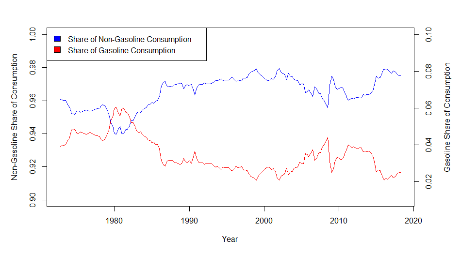{width=80%}

---

## Relationship between U.S. Consumption and Gasoline Expenditures (1973-2018)

- Gasoline share of consumption peaked in the early 1980's. 
- Low and stable global oil prices contributed to low shares during the 1990's.
- The more recent increase came in the early 2000's when oil prices increased due to high global oil demand. 

---

## Relationship between U.S. Consumption and Gasoline Expenditures (1973-2018)

- A key question in macroeconomics is how aggregate consumption responds to a shock to gasoline expenditures?
- If gasoline consumption is inelastic in the short-run, a positive shock to gasoline price will 
lead to higher gasoline expenditures, reducing spending on non-gasoline goods and services.

  - Hamilton (2009): Less discretionary income available as gasoline expenditures rise.  
  - Hamilton (1988): As gasoline expenditures increase, demand for energy-consuming goods falls.
  - Farrell and Greig (2015): The MPC for non-energy goods is 0.8 for every dollar saved on gasoline. 
  - Gicheva et al. (2008): Higher gasoline expenditures affects consumers spending on food. 

---

## U.S. Net Imports of Crude Oil (1973-2018)

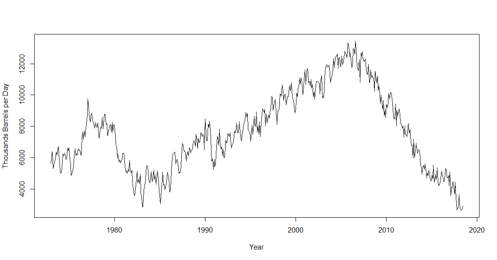{width=70%}

- Increase in gasoline expenditures have caused a transfer of U.S. income to foreign oil producers. 

- Higher gasoline expenditures have the same effect as a tax on the U.S. economy and should be expected to reduce aggregate consumption. 

## U.S. Net Imports of Crude Oil

- Jannet Yellen (2011):

"A higher price of imported oil is the equivalent of a tax on consumers. It is a transfer from US consumers to foreign oil producers. The effect should be the same as a tax increase. This tends to have a dampening effect on consumer spending."

- S&P Global Economists Beth Bovino and Satyam Panday (2018):

"This would be tantamount to a tax increase for American households."

---

## Fiscal Policy Literature

- The motivation for our analysis is the recent literature showing that the impact of fiscal policy depends on the state of the economy. 

- Tagkalakis (2008): Tax cuts are more effective in boosting private consumption in recessions.

- Auerbach and Gorodnichenko (2012): Fiscal multipliers are larger in recessions than expansions.

- Jorda and Taylor (2016): Fiscal austerity depresses the economy more in a slump as opposed to a boom. 

---

## Motivation

- Due to the oil-importing nature of the U.S. economy, shocks to gasoline expenditures have the same effect as a change in taxes.

- Fiscal policy has different effects in recessions and expansions. 

- It follows that the effect of a gasoline expenditure shock should depend on the state of the business cycle.

---

## Why Should We Care?

- A finding of economically meaningful asymmetry of this type requires a change to empirical and theoretical macroeconomic models that include energy prices.

- Implications for consumption forecasting.

- A failure to find evidence would cast doubt on the following:

  - Treatment of a gasoline expenditure shock as a change in taxes.
  - Claims that the effect of fiscal policy depends on the state of the economy.
  - Both claims. 

---

## Linear Model

We begin the analysis by estimating a (linear) bivariate structural VAR model,

$$z_{t}=\alpha+\sum_{i=1}^{p}\beta_{i}z_{t-i}+e_{t}$$

- $z_{t}=(\Delta gas_{t}, \Delta c_t)^{\prime}$
- $\Delta gas_{t}$ is the percentage change in gasoline expenditures in quarter t
- $\Delta c_{t}$ is a measure of consumption growth in quarter t
- $e_{t}=(e_{gas,t}, e_{c,t})'$ is a vector of reduced form residuals
- p represents the lag-length, whereas $\alpha$ and $\beta_{i}$ are vectors of coefficients.

---

## Linear Model 

- Gasoline expenditures are defined as the real personal consumption expenditures on gasoline goods and services.

- The four measures of consumption growth we use are:
  - RPCE
  - RPCE: Durables
  - RPCE: Nondurables
  - RPCE: Services

- Estimation of the linear VAR model does not represent an original contribution.

- It provides a benchmark for comparison with results of the nonlinear model.

---

## Data Transformation

- Data on consumption was downloaded from National Income and Product Accounts (NIPA) tables.

- Nominal variables are deflated using the *Price Index for PCE* and transformed into real variables.

- We conduct stationarity tests like the Augmented DF, Phillips-Perron, and ERS modified DF test.

- Results suggest that the real consumption variables are non-stationery in levels but stationery in percentage differences.

----

## Data Transformation

{width=70%}

---

## Data Transformation

{width=70%}

---

## Identification of the Linear Model 

- Our ordering of the variables implies a recursive system with gasoline expenditures ordered first.

- Consumption responds contemporaneously to gasoline expenditures, and not vice versa.

- The Cholesky decomposition of the variance-covariance matrix of reduced form
residuals suggests that,

$$e_t=
\begin{pmatrix}
e_{gas,t}\\ 
e_{c,t}
\end{pmatrix}=
\begin{bmatrix}
1 & 0\\ 
a_{21} & 1 
\end{bmatrix}
\begin{pmatrix}
\varepsilon_{gas,t}\\ 
\varepsilon_{c,t}
\end{pmatrix}$$

$$e_{gas,t}=\varepsilon_{gas,t}$$
$$e_{c,t}=a_{21}\varepsilon_{gas,t}+\varepsilon_{c,t}$$

---

## Identification of the Linear Model

- Metric for judging the plausability of our assumption is to look at the contemporaneous correlations of the VAR residuals.

- If gasoline expenditures are reacting immediately to macroeconomic shocks, it will cause a positive correlations 
between residuals.

- On the other hand, if consumption expenditures are reacting to gasoline expenditures, the correlation will be negative. 

|   Variables        | Correlation ($e_{gas,t}$, $e_{c,t}$)   |  
|:-------------------|:-------------:|
|        RPCE        |      -0.35         | 
|    RPCE:Durables        |      -0.07    | 
|    RPCE:Nondurables     |      -0.26    |  
|    RPCE:Services        |      -0.45    |     

---

## Interpretation of the Structural Shock

What is the structural shock ($\varepsilon_{gas,t}$) capturing?

- Unanticipated changes in the price of gasoline.

- Change in the preferences for larger or smaller vehicles.

- Change in travel patterns.

- Change in commuting behaviour due to fluctuations in house prices.

---

##  Results: Linear Model 

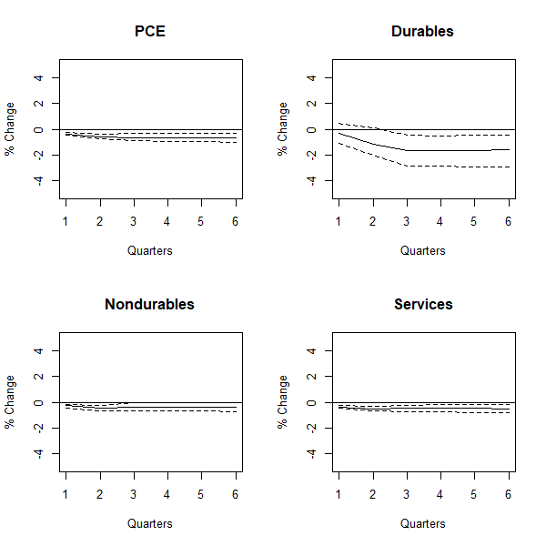{width=55%}

---

##  Results: Linear Model 

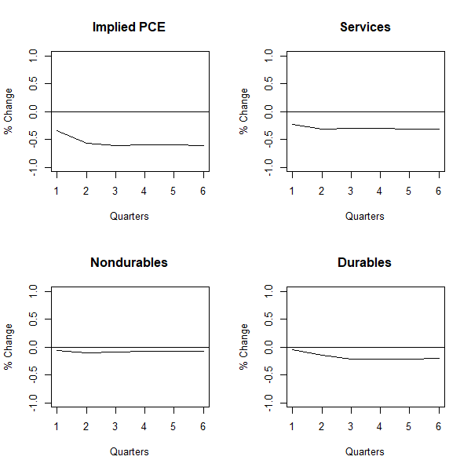{width=55%}

---

## Interpretation of the Results

- The average household income before taxes for 2017 was $73,572, of which $60,060 was used by households for consumption. 

- Based on our sample, consumers spend $2,000 on gasoline and other energy goods.  

- Following a $200 increase in gasoline expenditures across the course of the year, an average household reduces spending by $389 over the same time period.

- Services spending goes down by $182, durables spending declines by $123, and nondurables decreases by $47. 

---

## Other Categories of Consumption

We also consider the following measures of consumption for our analysis:

- Durables
  - Furnishing Goods    
  - Motor Vehicles
  - Recreational Goods
  
- Nondurables
  - Food and Beverages
  - Clothing
  
- Services
  - Housing and Utilities
  - Transportation 
  - Other (Communication, Education, etc)
  
---

## Results: Other Categories of Consumption

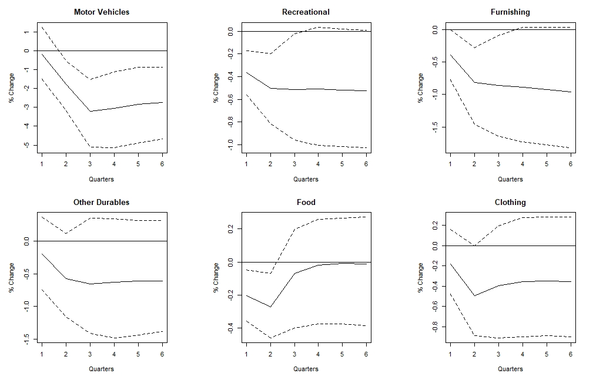{width=80%}

---

## Results: Other Categories of Consumption

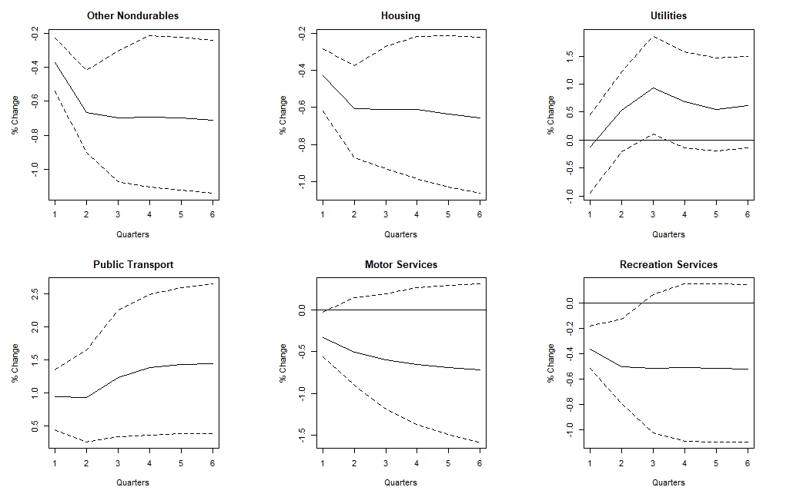{width=80%}

---

## Other Categories of Consumption

- A $200 annual increase in gasoline expenditures will force an average household to reduce spending on motor vehicles by $82 over the course of a year.

- Spending on furnishing and other durable household equipment, and clothing goes down by $16 and $10 respectively. 

- Spending on food stays at its original level.

- Public transportation expenditures increase by $9. 

- Expenditures on housing go down by $57, whereas utility bills increase by $11 over the course of a year. 

---

## Crowding Out of Non-Gasoline Spending

- The bivariate VAR model results suggest that as gasoline expenditures increase, consumption falls. 

- This decline in consumption is refered to as the 'discretionary income effect'.

- Once consumers are done paying for gasoline and other gasoline goods, they have less money to spend on other goods and services.

- These results are evidence that an increase in gasoline expenditures has the same effect as an increase in tax on consumers.

---

## Asymmetric Effects Over Business Cycle

- We model the asymmetric response of consumption variables to gasoline expenditure shocks in recessions and expansions using local projections.

- Local projections have the ability to accomodate nonlinear specification. 

- Estimating a linear model for each regime separately will make our estimates imprecise due to insufficient degrees of freedom for recessions.

- On the other hand, a nonlinear model allows us to utilize the entire dataset for our analysis.  

---

## Asymmetric Effects Over Business Cycle

Assuming that consumption growth responds contemporaneously to an increase in gasoline expenditures, the immediate response of consumption growth, $\Delta c_t$, to a gasoline expenditure shock can be estimated with the following regressions.

$$\Delta c_{t}=\alpha+ \sum_{i=0}^{k}\phi_{i}I_{t-i}+\sum_{i=0}^{k}\theta_{i}\triangle y_{t-i}+\sum_{i=1}^{k}\beta_{i}\Delta c_{t-i}+\sum_{i=0}^{k}\gamma_{i}\triangle gas_{t-i}$$

$$+\sum_{i=0}^{k}\delta_{i}inter_{t-i}+\varepsilon_t$$
Where, 
$$inter_{t-i}=I_{t-i} \times \triangle gas_{t-i}$$

---

## Asymmetric Effects Over Business Cycle

We follow AG (2012) and define a recession in the following manner, 
$$I_{t}=\begin{cases}
1 & F(z_{t})\geq0.8\\
0 & F(z_{t})<0.8
\end{cases}$$

The transition function that indicates the state of the economy takes the following functional form, 
$$F(z_t)= \frac{exp(-\gamma (z_t-\bar{d}))}{1+exp(-\gamma (z_t-\bar{d}))}, \gamma>0.$$

Where $z_t$ is equal to the seven quarter moving average growth rate of output and the value of $\gamma$ is calibrated to be equal to 3 so that the economy spends 20% of time in recession, $$Pr(F(z_t)>0.8)=0.2$$

---

## Asymmetric Effects Over Business Cycle

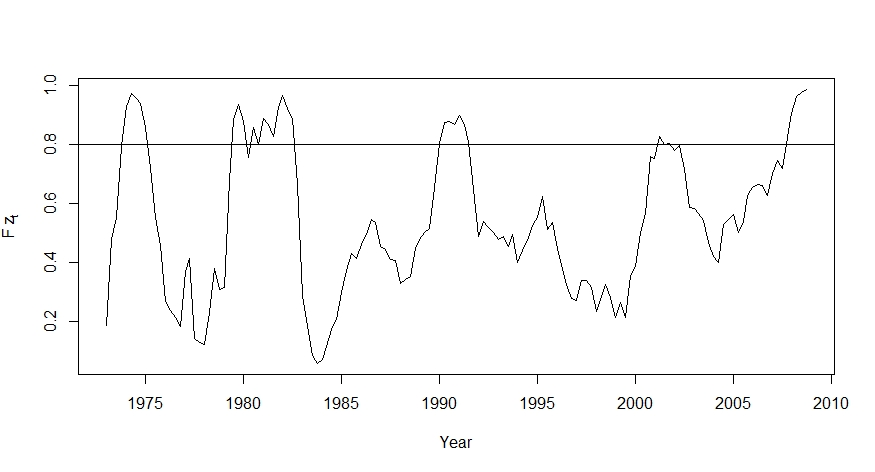{width=90%}

---

## Asymmetric Effects Over Business Cycle

Defining $\Delta gas_0$ as the change in gasoline expenditures in recessions and expansions, and $inter_0$ as the change in gasoline expenditures in recessions, the contemporaneous response of $\Delta c_t$, $\Delta c_0$ is defined as 
$$\Delta c_{0}=\hat{\gamma}_{0}\triangle gas_{0}+\hat{\delta}_{0}inter_{0}$$

$$\Delta c_{0}^{rec}=\hat{\gamma}_{0}\triangle gas_{0}+\hat{\delta}_{0}inter_{0}$$

$$\Delta c_{0}^{exp}=\hat{\gamma}_{0}\triangle gas_{0}$$

Since the shock under study is a 10% increase in gasoline expenditures $\triangle gas_{0}=0.1$. For a 10% shock in recessions, $inter_{0}=0.1$. For expansions, on the other hand, $inter_{0}=0$ since $I_{t}=0$. 

--- 

## Asymmetric Effects Over Business Cycle

We then define the initial response vector for each regime,
$$d_{i}^{rec}=\begin{bmatrix}\Delta c_{0}^{rec} & \triangle gas_{0} & inter_{0}\end{bmatrix}$$

$$d_{i}^{exp}=\begin{bmatrix}\Delta c_{0}^{exp} & \triangle gas_{0} & 0\end{bmatrix}$$

The s-period impulse responses are then calculated by estimating a reduced form regression,
$$\Delta c_{t}=\alpha+\sum_{i=1}^{k}\phi_{i}I_{t-i}+\sum_{i=1}^{k}\theta_{i}\triangle y_{t-i}+\sum_{i=1}^{k}\beta_{i}\Delta c_{t-i}+\sum_{i=1}^{k}\gamma_{i}\triangle gas_{t-i}$$
$$+\sum_{i=1}^{k}\delta_{i}inter_{t-i}+\varepsilon_{t}$$

---

## Asymmetric Effects Over Business Cycle

The response for both regimes is calculated using the following,
$$\hat{IR}_{s}^{rec}=\Phi_{s}d_{i}^{rec}=\hat{\beta}_{s}\Delta c_{0}+\hat{\gamma}_{s}\triangle gas_{0}+\hat{\delta}_{s}inter_{0}$$

and
$$\hat{IR}_{s}^{exp}=\Phi_{s}d_{i}^{exp}=\hat{\beta}_{s}\Delta c_{0}+\hat{\gamma}_{s}\triangle gas_{0}$$

where
$$\Phi_{s}=\begin{bmatrix}\hat{\beta}_{s} & \hat{\gamma}_{s} & \hat{\delta}_{s}\end{bmatrix}$$

---

## Asymmetric Effects Over Business Cycle

- Once we construct the impulse responses for both regimes, we can calculate the cumulative impulse response functions. 

- The rationale to use cumulative impulse responses is that it allows us to calculate the deviation of consumption from its’ long-run level.

$$CIR_{s}^{rec}=\sum_{j=0}^{s}\widehat{IR}_{j}^{rec}$$

$$CIR_{s}^{exp}=\sum_{j=0}^{s}\widehat{IR}_{j}^{exp}$$

---

## Asymmetric Effects Over Business Cycle

In order to calculate the asymmetric response of $c_{t}$ to gasoline expenditure shocks, we take the difference between the impulse responses across recessions and expansions.

$$CIR_{s}^{rec}-CIR_{s}^{exp}=\sum_{j=0}^{s}\widehat{IR}_{j}^{rec}-\sum_{j=0}^{s}\widehat{IR}_{j}^{exp}$$

$$\triangle CIR_{s}=\sum_{j=0}^{s}\widehat{IR}_{j}^{rec}-\sum_{j=0}^{s}\widehat{IR}_{j}^{exp}$$

If $\triangle CIR_{s}<0$, this means the response of consumption, $c_{t}$ is stronger in a recession as compared to an expansion. $\triangle CIR_{s}>0$ suggests the opposite.

---

## Results: Asymmetric Effects Over Business Cycle

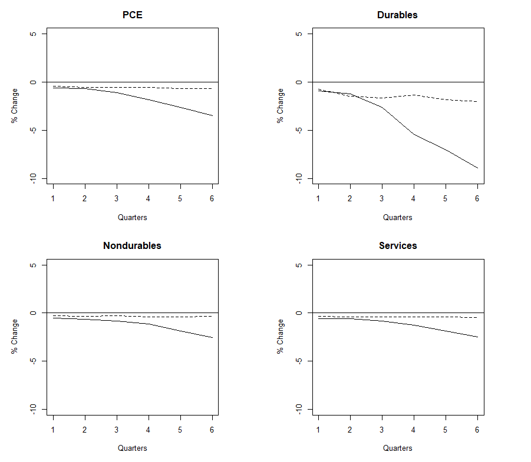{width=60%}

---

## Results: Asymmetric Effects Over Business Cycle

- Non-gasoline consumption decreases by around 2% more in recessions as opposed to in expansions. 

- Durables PCE decreases by almost 5.20% more following the shock in recessions.

- The difference in response among nondurables and services is -1.45% and -1.43% respectively.  

- The highly elastic nature of durable goods explains the big drop. 

---

## Results: Asymmetric Effects Over Business Cycle

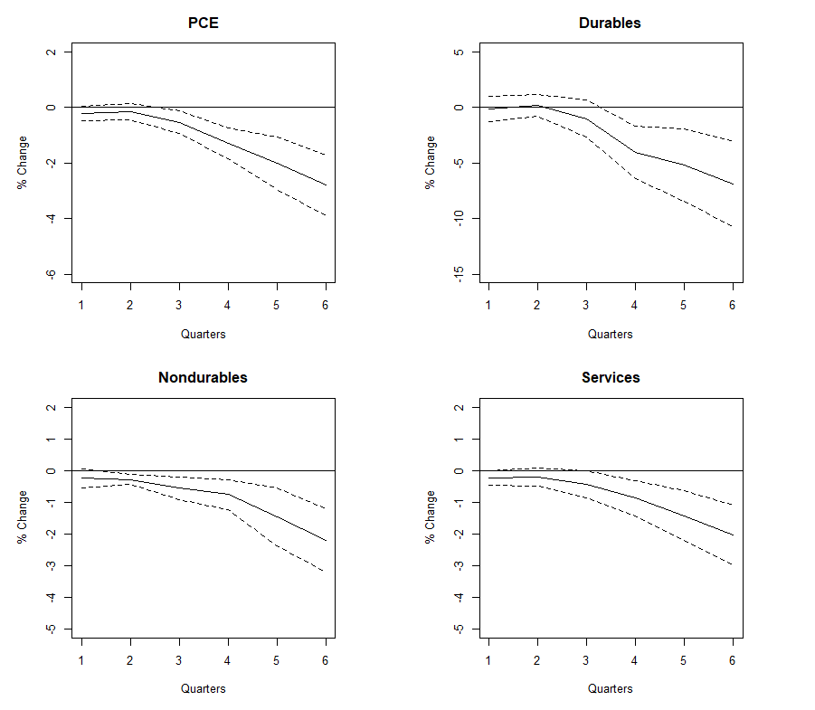{width=60%}

---

## Results: Asymmetric Effects Over Business Cycle 

{width=80%}

---

## Results: Asymmetric Effects Over Business Cycle 

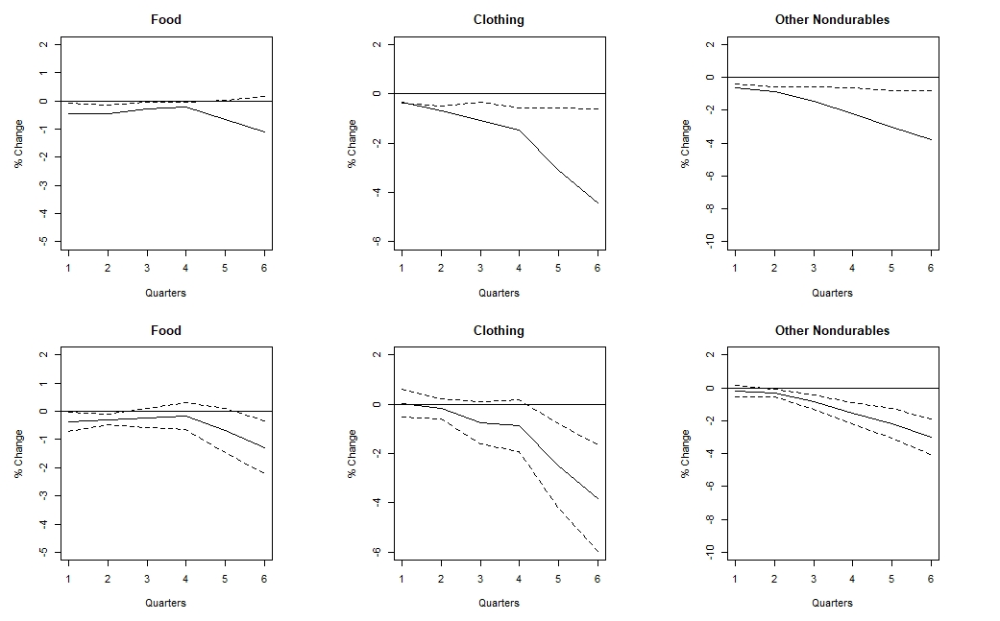{width=80%}

---

## Results: Asymmetric Effects Over Business Cycle 

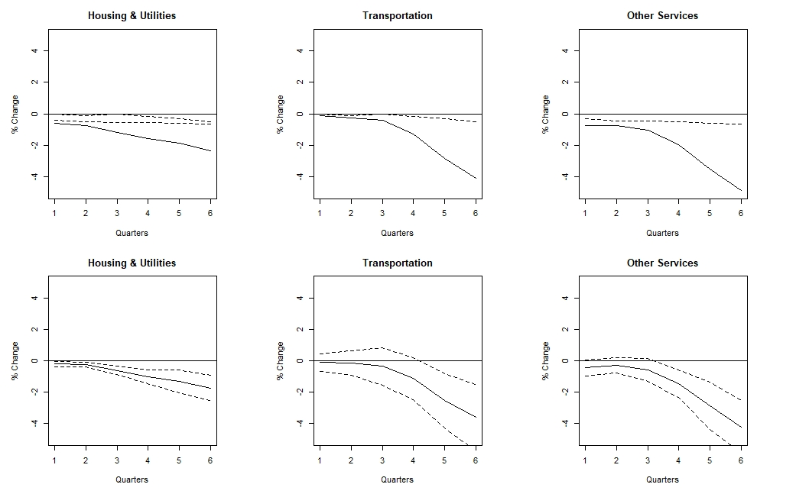{width=80%}

---

## Interpretation of the Results

- In dollar terms, a $200 increase in gasoline expenditures for any year reduces total non-gasoline spending for an average household by $1,545 in recessions and $383 in expansions. 

- Durables lose out by $530 in recessions as opposed to $137 in expansions. 

- Spending on nondurables decreases by $249 in recessions and $55 in expansions. 

- On the other hand, services spending goes down by $689 in recessions as opposed to $156 in expansions. 

---

## Source of Asymmetry

- Precautionary Savings Effect: Edelstein and Kilian (2009)

- We reestimate the nonlinear model using personal savings as the dependent variable,
$$Personal\;Savings=Disposable\;Income-Personal\;Outlays. $$

- The estimates from our model suggest that a 10% increase in gasoline expenditures over the course of a year 
increases savings by 3.57% in recessions as opposed to 0.92% in expansions.

---

## Source of Asymmetry

- The difference in response of savings indicates that the precautionary savings channel is amplified in recessions.

- A $200 increase in gasoline expenditures increases private savings by $398 in recessions and $60 in expansions.

- As gasoline expenditures increase in recessions, consumers become skeptical about the future path of the economy.

- Consumers increase their savings by more because they perceive a higher likelihood of unemployment during recessions. 

---

## Why Should We Care? (Change)

- A finding of economically meaningful asymmetry of requires a change to empirical and theoretical macroeconomic models that include energy prices.

- This suggests that the Federal Reserve's consumption forecasting models need to account for this asymmetric behaviour.

- Forecasts with the linear model might underestimate the effects of gasoline expenditure shocks. (Add details about models being forecasted.)

---

## Forecasting Implications 

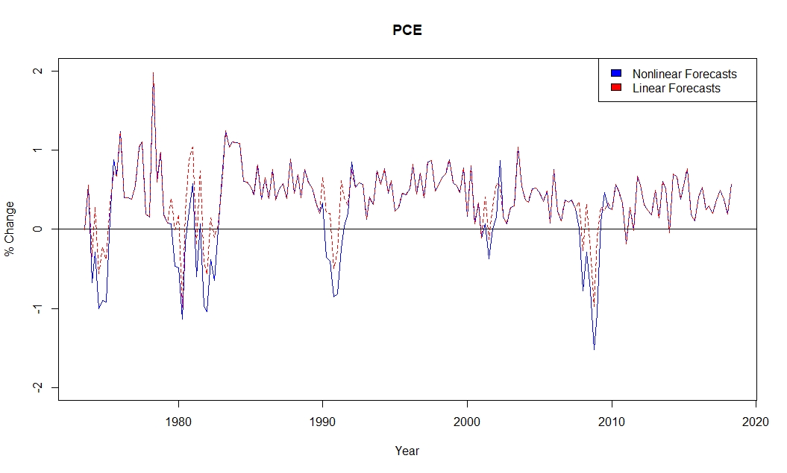{width=85%}

---

## Forecasting Implications 

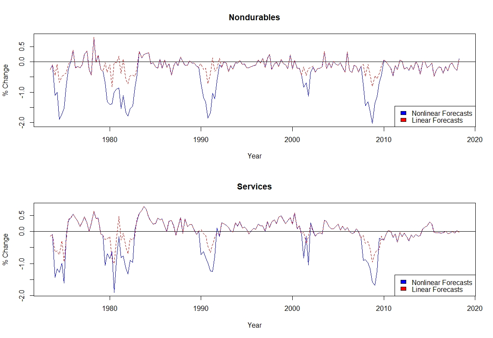

---

## Alternative Recession Dates

- Different measures of recessions have been proposed in the literature, i.e. unemployment rate, capacity utilization, and output gap. 

- We reestimate our model using an alternative recession date proposed by Hamilton. 

- Hamilton like AG (2012), also estimates recession dates,
$$P(Recession|GDP)=\frac{P(Recession\bigcap GDP)}{P(GDP)}$$

---

## Alternative Recession Dates (Change)

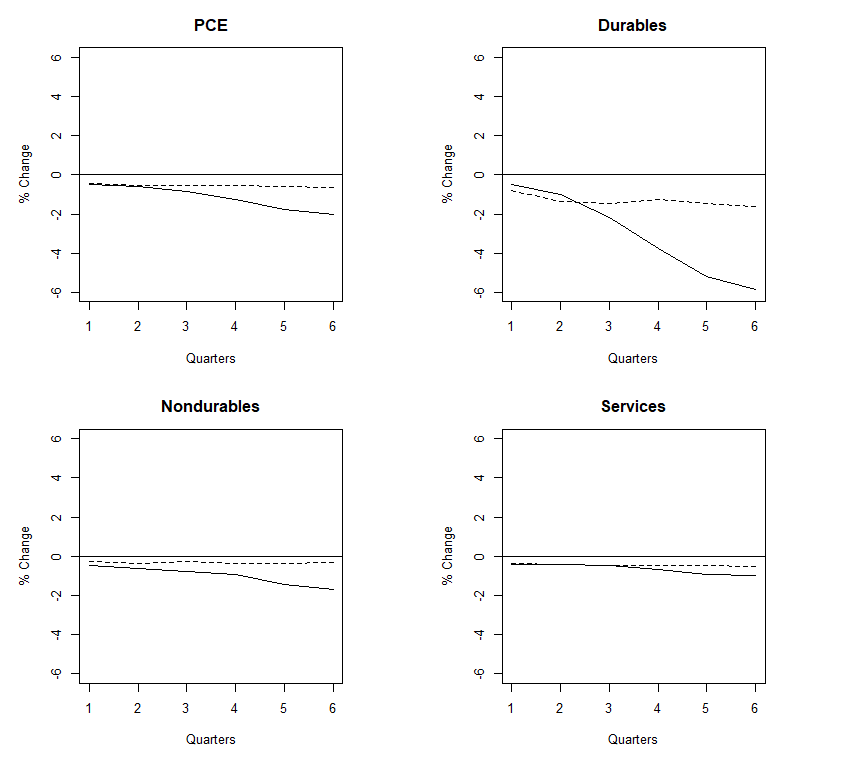{width=70%}

---

## Alternative Measure of Shock 

- We also redo the analysis using real price of gasoline. 

$$\Delta c_{t}=\alpha+ \sum_{i=0}^{k}\phi_{i}I_{t-i}+\sum_{i=0}^{k}\theta_{i}\triangle y_{t-i}+\sum_{i=1}^{k}\beta_{i}\Delta c_{t-i}+\sum_{i=0}^{k}\gamma_{i}\triangle rpg_{t-i}$$

$$+\sum_{i=0}^{k}\delta_{i}inter_{t-i}+\varepsilon_t$$
Where, 
$$inter_{t-i}=I_{t-i} \times \triangle rpg_{t-i}$$

---

## Alternative Measure of Shock (Change)

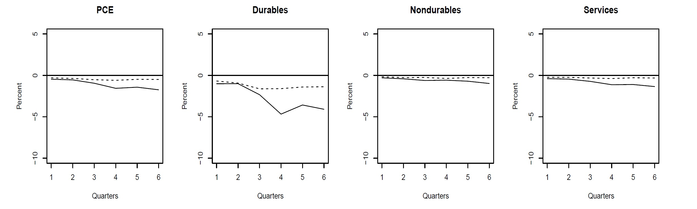

---

## Positive versus Negative Shocks

- We also consider the response of consumption to negative gasoline expenditure shocks.

- Oil price decreases cause a transfer of wealth from oil-exporting to oil-importing countries.

- A decrease in gasoline expenditures frees up a portion of income, consequently, increasing spending on non-gasoline goods and services. 

---

## Positive versus Negative Shocks

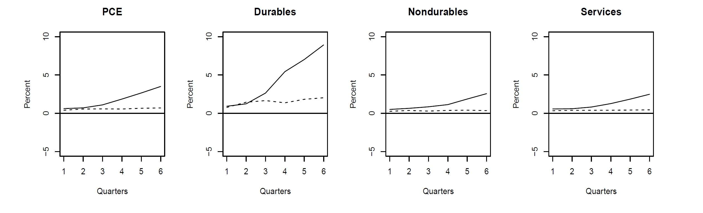

---

## Conclusion

- An increase in gasoline expenditures has the same effect as a tax on U.S. consumers, because it transfers a portion of theirincome to foreign oil producers and depresses non-gasoline consumption.

- We find evidence that the effect of a gasoline expenditure shock depends on the state of the business cycle.

- The response to a gasoline expenditure shock is much stronger in a recession than in an expansion.

- We present a forecasting model that accounts for the asymmetric behaviour of consumption to a gasoline expenditure shock across recessions and expansions.

---

## Conclusion

- The difference in response over the business cycle is due to the differences in household savings behaviour in recessions versus expansions.

- Our central estimates are robust to alternative measure of recession and shock as well.

- The extra income generated following a decrease in gasoline expenditures is more effective in boosting consumption during recessions.

---

## Thank You.

\begin{center}
Questions?
\end{center}

